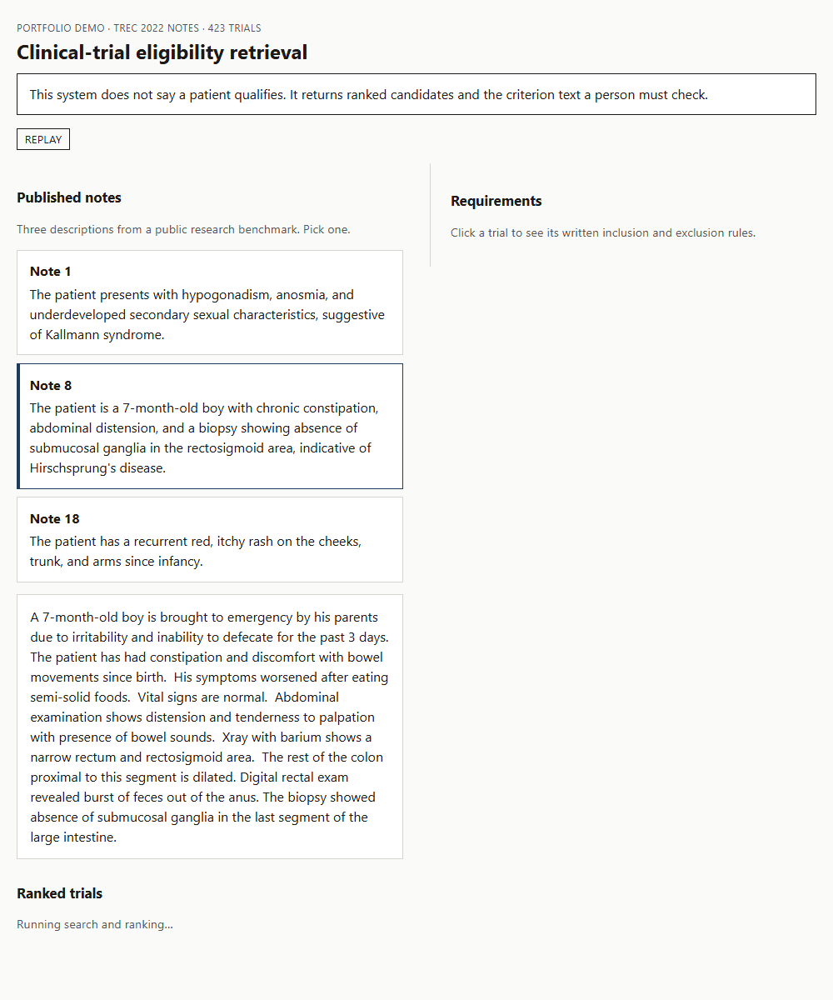
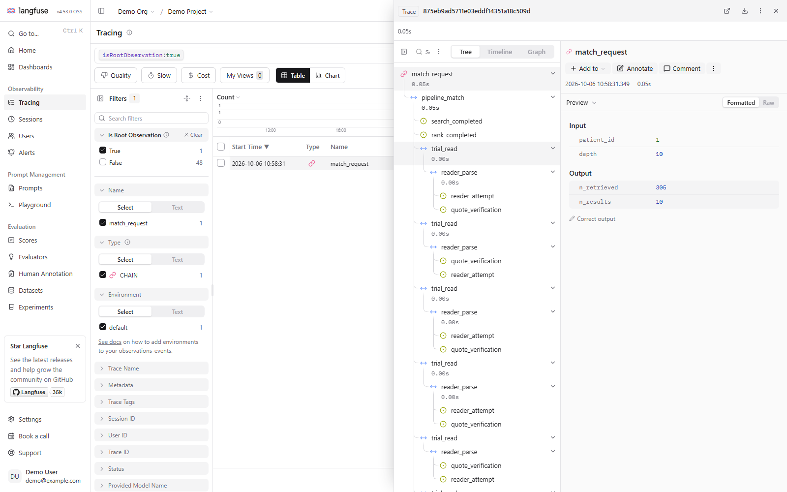

# Clinical-trial eligibility retrieval

**Finding the clinical trials a patient might be able to join — and showing a
human the exact rules they need to check.**

Clinical trials fail more often from not finding enough patients than from
anything that happens in the lab. The people who match patients to trials —
research coordinators — face a registry of more than 375,000 studies, each with
dozens of eligibility rules written in dense medical prose. Reading them is the
bottleneck.

This project builds and measures a system that narrows that search and shows its
working: a ranked shortlist, plus the specific criterion text a person must
verify, with the sentence the system relied on quoted underneath. **It returns
candidates for a human to check. It does not decide that anyone is eligible.**



*Runs on a laptop in one command. Search and ranking execute live; the `replay`
badge means the rule-reading replies are stored rather than a live model call.*

---

## What this is

A portfolio project, built to demonstrate machine-learning depth rather than to
ship a product — though it is containerised and runs from a clean clone.

That shapes what counts as success. **An honest negative result with a threshold
written down in advance is treated as more valuable than a flattering number.**
The project killed more than eight designs on measured evidence, retracted two of
its own headline figures when they failed re-examination, and documented every
one. That record is the deliverable as much as the code.

No real patient data is involved anywhere. The patient descriptions are either
invented or taken from a published research benchmark.

---

## The five findings worth knowing

**1. How you ask the search engine matters more than which search engine you
use.** Feeding the whole patient description in as one query finds 58% of the
trials a patient is eligible for. Having a model break that description into 10
to 30 separate search terms, running each as its own query, and merging the
results finds **91.6%** — while reading only 6% of the collection. Same data,
same models, a third more eligible trials.

**2. A small model you run yourself, fine-tuned for about $5, gets most of the
way to a frontier model.** On the hardest judgement in the task — telling "this
patient could join" from "right disease, but a rule disqualifies them" — the
scores run: 0.682 for the pipeline's default, 0.749 for simply asking a better
question, **0.779** after fine-tuning a 7-billion-parameter open model on the
benchmark's expert verdicts, and 0.821 for GPT-5.4. Fine-tuning closed roughly
40% of the gap for the price of a sandwich, on hardware that never sends patient
data anywhere.

**3. The system was measured for making things up.** When it quotes a sentence
as its evidence, how often does that sentence not actually exist in the source?
**3.75%** across 1,252 quotes. A naive check flagged 52% as suspect, and almost
all of that was benign — quotes stitched from two real passages, or the checker's
own word list missing a match. Separating real fabrication from checker noise is
the work. **No published system in this area reports a figure like this.**

**4. A patient admission note can only settle 7.6% of a trial's written rules.**
Trial criteria ask about lab values, prior treatments, exact dates. A five-to-ten
sentence admission note contains almost none of it. That single number explains
why an entire category of approach — walking every rule and tallying the answers
— cannot rank trials on this benchmark, and it is a measurement about the
benchmark rather than about any model.

**5. Which model wins depends on which stage you ask about.** A general-purpose
embedding model beat a medical specialist at finding candidate trials (91.8%
against 88.0%). At re-ranking those candidates, the medical specialist beat a
general-purpose model by more than two to one. Same corpus, opposite result,
because the two stages ask different questions.

---

## How it works

**Stage 1 — search.** A model turns the patient note into 10 to 30 search terms.
Each runs as its own query, two ways: BM25 word matching and vector similarity.
The lists are merged by reciprocal rank fusion and the top 6% kept, about 1,570
trials. This stage works well and is not under test.

**Stage 2 — ordering those 1,570.** Of them, roughly 4% are joinable, 5% are
right-disease-but-excluded, and **91% is junk** that matched a generic term like
"hypertension". A self-hosted Qwen2.5-7B model scores each trial for disease
relevance. Optionally, the fine-tuned eligibility model re-sorts the top 25 —
about five extra points of precision on the first page for roughly two-tenths of
a cent per patient.

**Stage 3 — reading the rules.** The model reads each eligibility rule
individually, judges it, and quotes the sentence it relied on. Every quote is
then checked against the source text, and the judgement is flagged if the quote
isn't there. Because a note settles only 7.6% of rules, this stage produces
evidence for a human rather than a better ranking.

---

## What this demonstrates

| Skill | How |
|---|---|
| **Information retrieval** | Hybrid keyword and vector search, reciprocal rank fusion, recall measured against expert verdicts |
| **Fine-tuning open models** | LoRA adapters on Qwen2.5-7B, a collapsed first attempt diagnosed and fixed, three random seeds reported with their spread rather than the best one |
| **Evaluation design** | Confidence intervals by resampling patients rather than pairs, thresholds committed to version control before each run, a pre-registered replication on held-out data |
| **Structured output and guardrails** | Schema validation with retries, and a programmatic check that every quoted span exists in the source before it reaches a human |
| **Agent orchestration** | LangGraph used to build a clarifying-question loop — measured, found to discard 10.4% of eligible trials wrongly, and not shipped |
| **Experiment tracking** | MLflow with a model registry, the shipping candidate marked, and the governing threshold commit recorded on every run |
| **Shipping** | Containerised service, HTTP API, seed data so a clean clone runs with no GPU and no API key, tests in the container |
| **Reading the literature critically** | A comparison against published systems that documents why most of those comparisons are invalid, rather than quietly making them |

---

## Try it (no GPU, no API key, one command)

```bash
git clone https://github.com/willfreeman1/clinical_trials_rag_agent.git
cd clinical_trials_rag_agent
docker compose up --build
```

Wait for the logs to say the app is ready, then open
**http://127.0.0.1:8088** and pick one of the three published patient
descriptions.

Search, fusion, ranking, rule splitting, quote checking and verdict combination
all run for real. The rule-reading replies for the three seed patients are
stored and replayed rather than calling a model, so no graphics card is needed —
and every response states which mode it is in.

The seed is three patients from the 2022 benchmark and 423 trials, about 3 MB,
with embeddings precomputed.

The demo now supports two vector-search backends: in-memory vectors
(`VECTOR_BACKEND=memory`) and Postgres pgvector
(`VECTOR_BACKEND=pgvector`). `docker compose up` uses pgvector by default, so
the retrieval path runs against a real vector database with no recurring cloud
cost.

<details>
<summary>API and tests</summary>

```bash
curl http://127.0.0.1:8088/health
curl -s http://127.0.0.1:8088/v1/match -H "Content-Type: application/json" -d "{\"patient_id\":\"1\"}"
```

On Windows PowerShell use `curl.exe` and put the JSON in a file
(`--data-binary @req.json`) — the `curl` alias eats the quotes.

```bash
docker compose --profile test run --rm test
```

A live model server is optional (`MODEL_MODE=live` and `MODEL_URL`). The demo
does not need it.

Observability is optional too. If you run Langfuse locally, set
`LANGFUSE_ENABLED=true` plus `LANGFUSE_HOST`, `LANGFUSE_PUBLIC_KEY`, and
`LANGFUSE_SECRET_KEY`. Then each `/v1/match` call writes a trace with
search/ranking/reader timings and quote-check buckets. Leave these unset for
normal demo runs.

Local proof from this repo's run:




</details>

---

## The measurements in full

All figures come from the TREC Clinical Trials benchmark — 75 patients from 2021
and 50 from 2022. Medical experts judged each patient–trial pair **joinable**,
**excluded** (right disease, but a rule disqualifies the patient), or
**irrelevant**.

### Finding the right trials

| | Result |
|---|---|
| Eligible trials kept, searching 6% of the collection | **91.6%** (2021), **91.4%** (2022) |
| Same search using the whole patient note as one query | 58.1% |

### Ordering the results

The default ranker is a self-hosted Qwen2.5-7B model scoring each trial for
disease relevance.

| | Graded NDCG@10 | Precision@10 |
|---|---|---|
| 2021, 75 patients | 0.657 (0.617–0.696) | 0.519 (0.468–0.567) |
| 2022, 50 patients | 0.662 (0.585–0.734) | 0.570 (0.494–0.642) |
| `gpt-4o-mini`, 2021, same shortlist | 0.568 (0.522–0.612) | 0.384 (0.331–0.437) |

Ranges are 95% intervals from resampling patients — not pairs, since pairs from
one patient are not independent. Precision@10 is the share of the first ten
trials an expert called joinable. Graded NDCG@10 is the benchmark's own measure,
which gives full credit for a joinable trial and **half credit for an excluded
one**.

The self-hosted model beats the paid commercial one here, with non-overlapping
intervals.

### Telling "joinable" from "right disease, but excluded"

The hardest judgement in the task. The measure is AUROC: given one joinable
trial and one excluded trial, how often does the score rank the joinable one
higher? A coin flip is 0.50.

| Approach | AUROC |
|---|---|
| Disease-relevance score (the default ranker) | 0.682 |
| Logistic regression combining every signal already on disk | 0.686 |
| Asking the model about eligibility instead, untrained | 0.749 |
| **Fine-tuned on the benchmark's expert verdicts** | **0.779** (three seeds: 0.793, 0.770, 0.773) |
| GPT-5.4, same 6,249 pairs | **0.821** (0.785–0.852); +0.038 against the trained 7B on the same patients |

The logistic-regression row is the control that makes the rest meaningful:
combining every signal already available bought almost nothing, so the gains came
from changing the question and from training, not from better bookkeeping.

Fine-tuning cost about $5 of rented GPU time per run, using a LoRA adapter — a
small file of extra numbers trained on top of a frozen base model. It learned
from comparisons **within a single patient**, so the patient's note carries no
information about which of two trials should rank higher and the model has to
read the trial.

Changing the question was worth about seven points; fine-tuning added about three
more. The cheap insight beat the expensive machinery by more than two to one.

### Reading the rules, and fabricated citations

A later pass asked the same 7B model to judge each eligibility rule on the 2022
top 25 — 1,250 trials, about 13 rules each — and quote the sentence it used.

**A patient note settles 7.6% of a trial's rules.** Under the benchmark
assessors' own combination rule the reader calls most trials compatible, meaning
"nothing in the note rules this out" rather than "this is a good match." It does
**not** sort joinable from excluded (AUROC **0.59**, interval 0.55–0.64) the way
the fine-tuned scorer does at 0.779.

When it does offer a quote, **3.75%** of those quotes were paraphrased or absent
from the source. Earlier work on a lung-cancer slice measured 1.2% and 1.3% — a
different model on a different corpus, so not a like-for-like comparison. The
whole reader pass cost $7.70.

---

## What didn't work

Negative results, each measured against a threshold set before the run:

- **Scoring text similarity to match patients to criteria.** Three attempts. A
  pair that should not match — cancer spread to the brain against cancer spread
  to the bone — scored *higher* than pairs that should, so no cutoff exists.
- **Off-the-shelf embeddings cannot represent "must have had" against "must not
  have had".** The gap between those two groups was 0.01, against a 0.10 spread
  within each group.
- **A fixed set of columns does not cover the problem.** 5,578 distinct facts
  across 300 trials, 77% appearing exactly once, and not one trial fully covered.
- **A medical vocabulary database (UMLS) could not supply a general term list.**
  56.4% coverage, 66.2% precision, with polarity flips — "non-squamous" resolving
  to "squamous".
- **Asking the patient clarifying questions** to resolve conditional rules. Built
  with LangGraph and measured: it discarded 10.4% of eligible trials wrongly.
- **Two cross-encoder re-rankers**, one general and one medical. The general one
  performed worse than doing nothing.
- **Weighted fusion, inverse-document-frequency weighting, and section-aware
  ranking.** All flat.

The project also corrected four of its own measurement errors, including
comparing two models at different search depths and treating a benchmark metric
as if it matched the task. Two published headline figures were withdrawn: a
fine-tuning result moved from 0.793 to 0.779 once two more random seeds were run,
and a claimed parity with a frontier model was retracted after reading that
paper's supplementary material showed the comparison was measuring something
else.

---

## Honest caveats

Read these before quoting any number above.

1. **The collection is the judged pool, not the full registry.** Every figure is
   measured against the 26,162 (2021) / 26,585 (2022) trials that experts judged
   — not the 375,581 in the full snapshot. Official benchmark submissions searched
   all 375,581. **That makes this an easier task, in this project's favour, and it
   means no comparison with official benchmark runs is valid.**
2. **No published system shares this evaluation setup.** Different papers use
   different collections, different treatments of the "excluded" verdict, and at
   least three incompatible definitions of "precision at 10". The project
   documents this rather than papering over it.
3. **Not everything is built.** There is no hosted database, no pipeline keeping
   the trial registry current, and no public URL — the container, API and page run
   on a laptop.

---

## Experiment tracking

A local MLflow store holds the fourteen runs that produced reported results —
not every experiment the project ran — with settings, metrics and intervals, the
write-up, and the threshold commit that governed each run. The three fine-tuned
adapters are on the registry, with the shipping candidate marked.

**The history was backfilled from stored results rather than captured live.**
Live tracking starts with the rule-by-rule reader.


---

## Reproducing the measurements

**The demo runs from a clone. The measurements do not.** The benchmark data is
excluded from version control and runs to about 2 GB, of which 1.7 GB is the
trial corpus. The repository holds code and results, not the indexes, scores or
expert verdicts.

The 2021 snapshot is downloadable from trec-cds.org
(`2021_data/ClinicalTrials.2021-04-27.part{1-5}.zip`). The expert relevance
verdicts came from NIST.

---

## Working practices

- Each run's deciding numbers go into `THRESHOLDS.md` **before** that run and are
  never edited afterwards. The git history showing that order is part of what the
  project demonstrates.
- Every reported figure carries an interval, and fine-tuned results report several
  random seeds with their spread rather than the best one.
- Results are retracted when they fail re-examination.
- Priorities, in order: **honest results > a working end-to-end system > breadth
  of features.**
