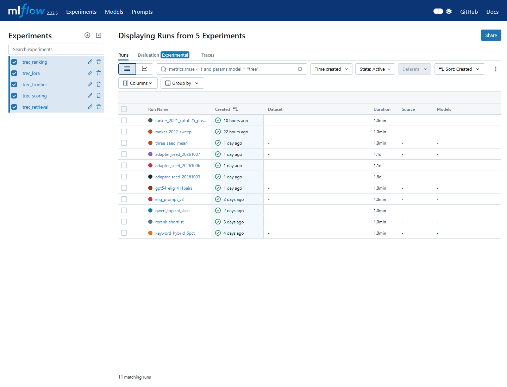
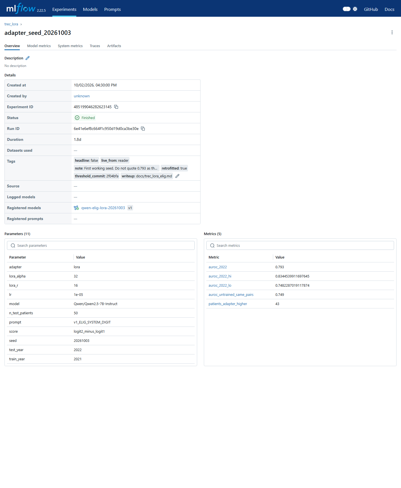
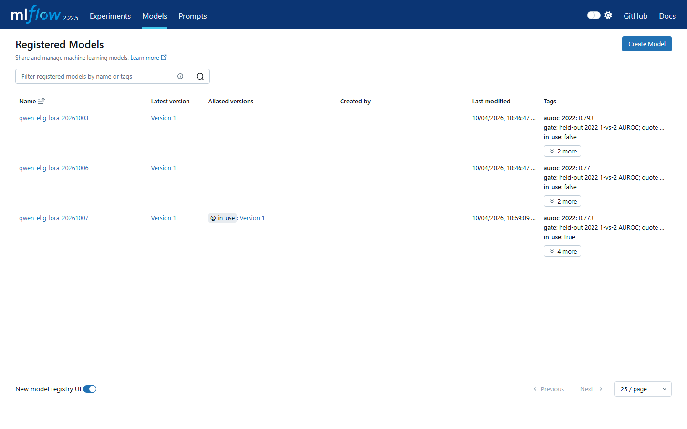

# Clinical-trial eligibility retrieval

Given a short description of a patient, find the clinical trials that patient
might be able to join — and show a human the specific eligibility rules they
need to check.

**This system never tells anyone they qualify for a trial.** It returns ranked
candidates plus the criterion text a person must verify. Nothing here touches
real patient data; the patient descriptions are either invented or taken from a
published research benchmark.

This is a portfolio project built to demonstrate machine-learning depth, not a
product. An honest negative result with a threshold committed in advance is
treated as more valuable here than a flattering number, and the project has
killed more than eight designs on measured evidence. That record is part of the
deliverable.

---

## What was measured

All figures come from the TREC Clinical Trials benchmark — 75 patients from 2021
and 50 from 2022, with relevance verdicts supplied by medical experts. Each
patient–trial pair was judged **joinable**, **excluded** (right disease, but a
rule disqualifies the patient), or **irrelevant**.

### Finding the right trials

| | Result |
|---|---|
| Eligible trials kept, searching 6% of the collection | **91.6%** (2021), **91.4%** (2022) |
| Same search using the whole patient note as one query | 58.1% |

The single largest win in the project: a model reads the patient note and writes
10 to 30 search terms, and **each term runs as its own separate search** — word
matching and vector similarity, merged. Using the note as one query instead
loses a third of the eligible trials.

A general-purpose embedding model beat a medical specialist at this stage
(91.8% against 88.0%). At the re-sorting stage the opposite held — the medical
specialist beat a general-purpose model by more than two to one. Same corpus,
opposite outcome, because the two stages ask different questions.

### Ordering the results

The default is a self-hosted Qwen2.5-7B model scoring each trial for disease
relevance (`topical slice` in the code and write-ups).

| | Graded NDCG@10 | Precision@10 |
|---|---|---|
| 2021, 75 patients | 0.657 (0.617–0.696) | 0.519 (0.468–0.567) |
| 2022, 50 patients | 0.662 (0.585–0.734) | 0.570 (0.498–0.646) |
| `gpt-4o-mini`, 2021, same shortlist | 0.568 (0.522–0.612) | 0.384 (0.331–0.437) |

Ranges are 95% intervals from resampling patients (not pairs — pairs from one
patient are not independent). Precision@10 is the share of the first ten trials
an expert called joinable. Graded NDCG@10 is the benchmark's own measure, which
awards full credit for a joinable trial and **half credit for an excluded one**.

The self-hosted model beats the paid commercial one on this task, with
non-overlapping intervals.

### Telling "joinable" from "right disease, but excluded"

The hardest judgement in the task, and the one nothing in this project could do
until late. The measure is AUROC: given one joinable trial and one excluded
trial, how often does the score rank the joinable one higher? 0.50 is a coin
flip.

| Approach | AUROC |
|---|---|
| Disease-relevance score (the default ranker) | 0.682 |
| Logistic regression combining every signal already on disk | 0.686 |
| Asking the model about eligibility instead, untrained | 0.749 |
| **Fine-tuned on the benchmark's human verdicts** | **0.779** (three seeds: 0.793, 0.770, 0.773) |
| GPT-5.4 — *different and smaller sample, not comparable* | 0.83 |

The fine-tuning cost about $5 of rented GPU time per training run. It used a
LoRA adapter — a small file of extra numbers trained on top of a frozen base
model — learning from comparisons **within a single patient**, so the patient's
note carries no information about which of two trials ranks higher and the model
has to read the trial.

Changing the question was worth about seven points; fine-tuning added about
three more. The cheap insight beat the expensive machinery by more than two to
one.

### Reading the rules, one by one

A later pass asked the same 7B model to judge each eligibility
rule on the 2022 top 25 (1,250 pairs) and to quote the sentence it
used. Design locked before any score; the first 50-trial probe
broke on empty quotes and is not an accuracy figure.

A TREC note settles **7.6%** of a trial's rules. Under the
assessors' combination rule the reader calls most trials
compatible — "nothing in the note rules this out," not "this is
a good match." It still does **not** sort joinable from excluded
(AUROC **0.59** under all three combination rules, interval
0.55–0.64) the way the fine-tuned scorer does (0.779). When it
does offer a quote, **3.75%** of those quotes were paraphrased or
absent from the source. That is a different measurement from the
5% lung-cancer support reference and from the 1.3% GPT-5.4
audit on that slice. Cost **$7.70**. Details:
`docs/trec_reader.md`.

### Fabricated citations

When the system quotes a sentence as its evidence, how often does that sentence
not exist in the source? On the earlier lung-cancer slice, **1.2%** for the
reader and **1.3%** in an audit of 4,384 stored quote slots. On the TREC
2022 top-25 reader, **3.75%** of offered quotes were paraphrased or
absent (`docs/trec_reader.md`).

A naive checker flagged 52% of quotes as suspect. Almost all of that was benign
— quotes stitched from two real passages, or a word-list miss in the checker
itself. Only paraphrases and genuinely absent text count, and that is the 1.3%.
No published system in this area reports a figure like this.

---

## Honest caveats

Read these before quoting any number above.

1. **The collection is the judged pool, not the full registry.** Every figure is
   measured against the 26,162 (2021) / 26,585 (2022) trials that experts
   judged — not the 375,581 in the full snapshot. Official benchmark
   submissions searched all 375,581. **That makes this an easier task, in this
   project's favour, and it means no comparison with official benchmark runs is
   valid.** See `docs/trec_published_standings.md`.
2. **No official submission was ever made.** Nothing here was scored by the
   benchmark organisers.
3. **No published system shares this evaluation setup.** Different papers use
   different collections, different treatments of the "excluded" verdict, and at
   least three incompatible definitions of "precision at 10". The comparison
   table in `docs/trec_published_standings.md` documents this rather than
   papering over it.
4. **The 2023 benchmark year is a different task** and was deliberately left
   alone. Its criteria are sparse questionnaire fields rather than prose, and
   first-stage recall falls to 65.4%.
5. **The two-stage sort is an option, not the default.** Re-sorting the top 25
   with the eligibility model adds about five points of precision for roughly
   two-tenths of a cent per patient. It replicated on a pre-registered test, but
   60 of those 75 patients were in the model's training data, so the
   conservative figure is the one from unseen patients.

---

## How it works

**Stage 1 — search.** A model turns the patient note into 10 to 30 search terms.
Each runs as its own query, two ways: BM25 word matching and vector similarity.
The result lists are merged by reciprocal rank fusion and the top 6% kept, about
1,570 trials. This stage works and is not under test.

**Stage 2 — ordering those 1,570.** Of them, roughly 4% are joinable, 5% are
right-disease-but-excluded, and **91% is junk** that matched a generic term like
"hypertension". A self-hosted Qwen2.5-7B model scores each trial for disease
relevance. A fine-tuned variant can optionally re-sort the top 25.

**Stage 3 — reading the rules.** Measured on this benchmark's 2022
top 25. The model reads each eligibility rule (about 13 per trial
here, not the ~43 from the earlier lung-cancer slice), judges it,
and quotes the sentence it relied on. A TREC note settles 7.6%
of those rules, so the reader does not replace the fine-tuned
eligibility score. `docs/trec_reader.md`.

---

## Experiment tracking

A local MLflow store holds the thirteen TREC runs that produced reported
results — not every experiment the project ran — with settings, metrics and
intervals, the write-up, and the threshold commit that governed the run. The
three fine-tuned adapters are on the registry; seed 20261007 is marked as the
one in use. The store is not in git (`mlruns/` is large and local). The same
numbers are in `docs/trec_mlflow_runs.csv`, one row per run-and-metric. The
history was backfilled from stored results rather than captured live; live
tracking starts with the reader.

---

## What is not built

Stated plainly, because the measurement record is deliberately ahead of the
engineering:

- A production vector database and a pipeline that keeps trials current
- An agent framework with explicit function calling
- Validated structured output and guardrails
- A deployed service, an API, or a container

---

## Where to read what

| File | What it is |
|---|---|
| `HANDOFF.md` | Why the architecture is shaped this way, the measurement errors behind four retired thresholds, the dead ends not worth re-running |
| `docs/trec_published_standings.md` | How this project's numbers relate to published work, and why most comparisons are invalid |
| `docs/trec_hybrid_retrieval.md` | The search stage and the keyword-decomposition result |
| `docs/trec_lora_rank.md` | Benchmark-standard measures for every approach tried, both years |
| `docs/trec_model_currency.md` | How the system would stay current; distillation designed, not run; MLflow |
| `docs/trec_mlflow_runs.csv` | Long table of the thirteen reported runs: one row per run-and-metric, with intervals |
| `docs/trec_lora_elig.md` | The fine-tuning work, including a collapsed first attempt and its diagnosis |
| `docs/trec_frontier_elig.md` | GPT-5.4 as a measured baseline |
| `docs/trec_reader.md` | Rule-by-rule reader on the 2022 top 25: 7.6% of rules settled, AUROC 0.59 under all three combination rules, D+E 3.75% |
| `docs/trec_shortlist_diagnosis.md`, `docs/trec_shortlist_fix.md` | What the shortlist contains, and three approaches that did not help |
| `THRESHOLDS.md` | Each run's deciding numbers, committed **before** that run |
| `DECISIONS.md` | Every decision, its options, and what evidence would reverse it |
| `CONTEXT.md` | Project purpose, medical vocabulary, settled arguments |
| `docs/papers/` | Local copies of the papers this work is measured against |

Earlier work on a lung-cancer slice — closed-vocabulary matching, the
containment hierarchy, the fabricated-quote audit — is in `docs/step*.md` and
`report.md`. `docs/STATUS.md` and `SPIKE_2_PLAN.md` describe that earlier phase
and are partly superseded.

---

## Reproducing this

**You cannot, from a clone alone.** `data/` is excluded from version control and
runs to about 2 GB, of which 1.7 GB is the trial corpus. The repository holds
code and write-ups, and none of the measurements, indexes, scores or expert
verdicts.

The 2021 snapshot is still downloadable from trec-cds.org
(`2021_data/ClinicalTrials.2021-04-27.part{1-5}.zip`). The expert verdicts came
from NIST; `docs/trec_retrievability.md` records the provenance.

Set `PYTHONIOENCODING=utf-8` and pass `encoding="utf-8"` to every file read and
write. The trial text contains `≥`, `≤` and `×`, which crash a default Windows
console.

---

## Working practices

- Each run's deciding numbers go into `THRESHOLDS.md` **before** that run, and
  are never edited afterwards. The git history showing that order is part of
  what the project demonstrates.
- Every reported figure carries an interval, and fine-tuned results report
  several random seeds with their spread rather than the best one.
- Results are retracted when they fail re-examination. The fine-tuning headline
  moved from 0.793 to 0.779 when two more seeds came in, and a claim of parity
  with a frontier model was withdrawn once the comparison turned out to be
  measuring something else.
- Priorities, in order: **honest results > a working end-to-end system >
  breadth of features.**

**The system does not say a patient qualifies.**
